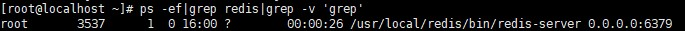
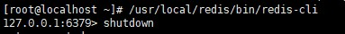

# Redis安装

## 一. 下载

https://redis.io/download 

下载稳定版本

或者

```
wget http://download.redis.io/releases/redis-4.0.8.tar.gz
```


## 二. 安装

### 1.创建文件夹

若是下载的tar，首先到/usr/local 路径下创建 redis 文件夹

```shell
mkdir /usr/local/soft/redis
```

将文件下载的tar 上传到redis文件夹下

### 2. 解压

```shell
tar xzvf redis-5.0.5.tar.gz
```

### 3. 安装

```shell
cd /usr/local/soft/redis-5.0.5
```

### 4. 编译

```shell
make
```

### 5. 移动常用文件

创建路径

```shell
mkdir -p /usr/local/soft/redis/etc
mkdir -p /usr/local/soft/redis/bin
```

移动

```shell
cd /usr/local/soft/redis-5.0.5
cp ./redis.conf /usr/local/soft/redis/etc
cd /usr/local/soft/redis-5.0.5/src
cp ./mkreleasehdr.sh redis-benchmark redis-check-aof redis-check-rdb redis-cli redis-sentinel redis-server redis-trib.rb /usr/local/soft/redis/bin
```

### 6.更改配置文件

```shell
vim /usr/local/soft/redis/etc/redis.conf
```

将daemonize改为yes，并将bind 127.0.0.1 改为bind 0.0.0.0

### 7. 启动redis服务

```shell
/usr/local/soft/redis/bin/redis-server /usr/local/soft/redis/etc/redis.conf
```

查看端口号

```
ps -ef|grep redis|grep -v 'grep'
```

若返回结果为：



则表示已启动

### 8. 客户端连接

```shell
/usr/local/soft/redis/bin/redis-cli
```

若显示：



则表示已经连接上redis可以正常使用

ps：

​	shutdown	表示关闭服务器

​	exit				表示退出客户端

