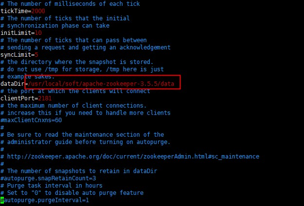
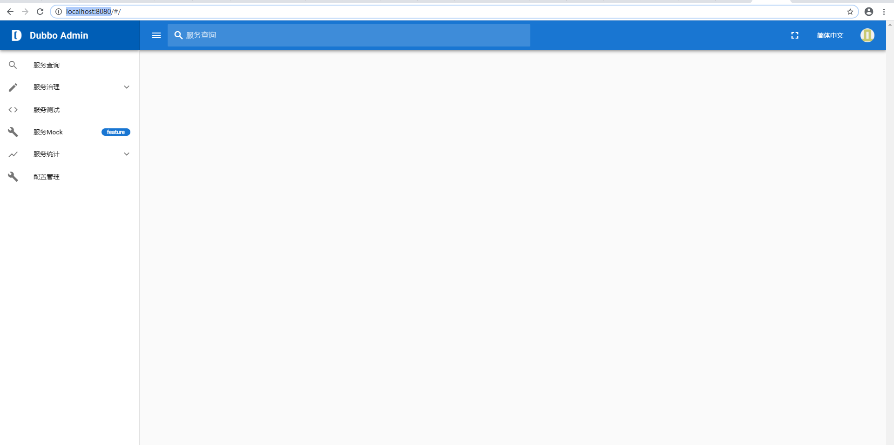

# Dobbo + Zookeeper 安装

## 一、前言

### 1. 微服务

　　微服务架构是互联网很热门的话题，是互联网技术发展的必然结果。它提倡将单一应用程序划分成一组小的服务，服务之间互相协调、互相配合，为用户提供最终价值。虽然微服务架构没有公认的技术标准和规范或者草案，但业界已经有一些很有影响力的开源微服务架构框架提供了微服务的关键思路，例如 Dubbo 和 Spring Cloud，各大互联网公司也有自研的微服务框架，但其模式都于这二者相差不大。**微服务主要的优势如下**：

- 降低复杂度

将原来偶合在一起的复杂业务拆分为单个服务，规避了原本复杂度无止境的积累。每一个微服务专注于单一功能，并通过定义良好的接口清晰表述服务边界。每个服务开发者只专注服务本身，通过使用缓存、DAL 等各种技术手段来提升系统的性能，而对于消费方来说完全透明。

- 可独立部署

由于微服务具备独立的运行进程，所以每个微服务可以独立部署。当业务迭代时只需要发布相关服务的迭代即可，降低了测试的工作量同时也降低了服务发布的风险。

- 容错

在微服务架构下，当某一组件发生故障时，故障会被隔离在单个服务中。 通过限流、熔断等方式降低错误导致的危害，保障核心业务正常运行。

- 扩展

单块架构应用也可以实现横向扩展，就是将整个应用完整的复制到不同的节点。当应用的不同组件在扩展需求上存在差异时，微服务架构便体现出其灵活性，因为每个服务可以根据实际需求独立进行扩展。

### 2. zookeeper

#### 简介

Zookeeper是一个高效的分布式协调服务，可以提供配置信息管理、命名、分布式同步、集群管理、数据库切换等服务。它不适合用来存储大量信息，可以用来存储一些配置、发布与订阅等少量信息。Hadoop、Storm、消息中间件、RPC服务框架、分布式数据库同步系统、分布式应用配置管理、统一命名服务、状态同步服务、集群管理等功能，这些都是Zookeeper的应用场景。

#### 结构

Zookeeper使用的数据结构为树形结构，根节点为"/"。


每个子目录项如 NameService 都被称作为 znode(目录节点)，和文件系统一样，我们能够自由的增加、删除znode，在一个znode下增加、删除子znode，唯一的不同在于znode是可以存储数据的。

有四种类型的znode：

- **PERSISTENT-持久化目录节点**

  客户端与zookeeper断开连接后，该节点依旧存在

- **PERSISTENT_SEQUENTIAL-持久化顺序编号目录节点**

  客户端与zookeeper断开连接后，该节点依旧存在，只是Zookeeper给该节点名称进行顺序编号

- **EPHEMERAL-临时目录节点**

  客户端与zookeeper断开连接后，该节点被删除

- **EPHEMERAL_SEQUENTIAL-临时顺序编号目录节点**

  客户端与zookeeper断开连接后，该节点被删除，只是Zookeeper给该节点名称进行顺序编号

#### 集群

Zookeeper集群中的节点，根据其身份特性分为leader、follower、observer。leader负责客户端writer类型的请求；follower负责客户端reader类型的请求，并参与leader选举；observer是特殊的follower，可以接收客户端reader请求，但是不会参与选举，可以用来扩容系统支撑能力，提高读取速度。

Zookeeper集群中节点个数一般为奇数个（>=3），若集群中Master挂掉，剩余节点个数在半数以上时，就可以推举新的主节点，继续对外提供服务。

客户端发起事务请求，事务请求的结果在整个Zookeeper集群中所有机器上的应用情况是一致的。不会出现集群中部分机器应用了该事务，而存在另外一部分集群中机器没有应用该事务的情况。在Zookeeper集群中的任何一台机器，其看到的服务器的数据模型是一致的。Zookeeper能够保证客户端请求的顺序，每个请求分配一个全局唯一的递增编号，用来反映事务操作的先后顺序。Zookeeper将全量数据保存在内存中，并直接服务于所有的非事务请求，在以读操作为主的场景中性能非常突出。

Zookeeper是一个基于观察者模式设计的分布式服务管理框架，负责存储和管理相关数据，接收观察者的注册。一旦这些数据的状态发生变化，zookeeper就负责通知那些已经在zookeeper集群进行注册并关心这些状态发生变化的观察者，以便观察者执行相关操作。

#### 底层原理

Zookeeper使用的是==ZAB原子消息广播协议==，节点之间的一致性算法为==Paxos（[ˈpæksoʊs]，帕克索斯）==，能够保障分布式环境中数据的一致性。分布式场景下高可用是Zookeeper的特性，可以采用第三方客户端的实现，即Curator框架。

Paxos 算法解决的问题是一个分布式系统如何就某个值（决议）达成一致。一个典型的场景是，在一个分布式数据库系统中，如果各节点的初始状态一致，每个节点执行相同的操作序列，那么他们最后能得到一个一致的状态。为保证每个节点执行相同的命令序列，需要在每一条指令上执行一个“一致性算法”以保证每个节点看到的指令一致。一个通用的一致性算法可以应用在许多场景中，是分布式计算中的重要问题。因此从20世纪80年代起对于一致性算法的研究就没有停止过。节点通信存在两种模型：共享内存（Shared memory）和消息传递（Messages passing）。Paxos 算法就是一种基于消息传递模型的一致性算法。

不仅仅是分布式系统中，凡是多个过程需要达成某种一致的场合都可以使用Paxos 算法。一致性算法可以通过共享内存（需要锁）或者消息传递实现，Paxos 算法采用的是后者。Paxos 算法适用的几种情况：一台机器中多个进程/线程达成数据一致；分布式文件系统或者分布式数据库中多客户端并发读写数据；分布式存储中多个副本响应读写请求的一致性。

### 3. Dubbo

Dubbo是Alibaba开源的分布式服务框架，它最大的特点是按照分层的方式来架构，使用这种方式可以使各个层之间解耦合（或者最大限度地松耦合）。从服务模型的角度来看，    Dubbo采用的是一种非常简单的模型，要么是提供方提供服务，要么是消费方消费服务，所以基于这一点可以抽象出服务提供方（Provider）和服务消费方（Consumer）两个角色。关于注册中心、协议支持、服务监控等内容，详见后面描述。  Webservice也是一种服务框架，但是webservice并不是分布式的服务框架，他需要结合F5实现负载均衡。因此，dubbo除了可以提供服务之外，还可以实现软负载均衡。它还提供了两个功能Monitor 监控中心和调用中心。这两个是可选的，需要单独配置。

Dubbo是阿里巴巴SOA服务化治理方案的核心框架，致力于提供高性能和透明化的RPC远程服务调用方案，以及SOA服务治理方案。其核心部分包含:

- **远程通讯:** 提供对多种基于长连接的NIO框架抽象封装，包括多种线程模型，序列化，以及“请求-响应”模式的信息交换方式。
- **集群容错:** 提供基于接口方法的透明远程过程调用，包括多协议支持，以及软负载均衡，失败容错，地址路由，动态配置等集群支持。
- **自动发现:** 基于注册中心目录服务，使服务消费方能动态的查找服务提供方，使地址透明，使服务提供方可以平滑增加或减少机器。

###### 那么，Dubbo能做什么？

- 透明化的远程方法调用，就像调用本地方法一样调用远程方法，只需简单配置，没有任何API侵入。
- 软负载均衡及容错机制，可在内网替代F5等硬件负载均衡器，降低成本，减少单点。
- 服务自动注册与发现，不再需要写死服务提供方地址，注册中心基于接口名查询服务提供者的IP地址，并且能够平滑添加或删除服务提供者。

### 4. Nacos

Nacos（阿里）的配置中心和注册中心实现的是两套代码，和Zk不同，

#### 4.1.配置中心

Nacos和Zookeeper都可以作为配置中心，做一些可以实时变化的配置数据存储，然后实时更新线上数据。

##### 4.1.1 存储和数据更新

Nacos：依赖Mysql数据库做数据存储，当有数据更新的时候，直接更新数据库的数据，然后将数据更新的信息异步广播给Nacos集群中所有服务节点数据变更，在由Nacos服务节点更新本地缓存，然后将通知客户端节点数据变化。

Zookeeper:利用zk的树型结构做数据存储，当有数据更新的时候使用过半机制保证各个节点的数据一致性；然后通过zk的事件机制通知客户端。

这里可以明显发现差异：

- 服务器存储位置不同，分别采用mysql和zk本身存储
- 消息发送，一个有采用过半机制保持一致性，另外一个异步广播，通过后台线程重试保证。

#### 4.2.注册中心

Nacos：nacos支持两种方式的注册中心，持久化和非持久化存储服务信息。

- **非持久**直接存储在nacos服务节点的内存中，并且服务节点间采用去中心化的思想，服务节点采用hash分片存储注册信息
- **持久化**使用Raft协议选举master节点，同样采用过半机制将数据存储在leader节点上

Zookeeper:利用zk的树型结构做数据存储，服务注册和消费信息直接存储在zk树形节点上，集群下同样采用过半机制保证服务节点间一致性

这里的差异：

- nacos支持持久化和非持久化存储即有点 AP和CP 分布式一致性的概念，nacos的CP-持久化更像贴合zk的模式（过半机制），默认非持久化采用内存存储速度更快，而且分片存储，不利点就是某个服务节点挂掉，可能出现部分时间调用失败。因为服务调用本身就是实时的，持久化存储起来应该意义不大，及时变化才是真理。

所谓仁者见仁，智者见智。每一款产品都有各自的特点，具体看怎么用就看自身的业务的场景了。

## 二、Dubbo和Spring Cloude

###  ① 总体框架

微服务的核心要素在于服务的发现、注册、路由、熔断、降级、分布式配置，基于上述几种必要条件对 Dubbo 和 Spring Cloud 做出对比。

**Dubbo 核心部件**，如下图所示：


- `Provider`： 暴露服务的提供方，可以通过`jar`或者容器的方式启动服务；
- `Consumer`：调用远程服务的服务消费方；
- `Registry`： 服务注册中心和发现中心；
- `Monitor`： 统计服务和调用次数，调用时间监控中心，Dubbo 的控制台页面中可以显示，目前只有一个简单版本；
- `Container`：服务运行的容器。

**Spring Cloud 总体架构**，如下图所示：


- `Service Provider`： 暴露服务的提供方；
- `Service Consumer`：调用远程服务的服务消费方；
- `Eureka Server`： 服务注册中心和服务发现中心。

**点评**：从整体架构上来看，二者模式接近，都需要服务提供方、服务消费方和注册中心。

### ② 微服务架构核心要素


Dubbo 只是实现了服务治理，而 Spring Cloud 子项目分别覆盖了微服务架构下的众多部件，而服务治理只是其中的一个方面。Dubbo 提供了各种 Filter，对于上述中“无”的要素，可以通过扩展 Filter 来完善。例如，

- 分布式配置：可以使用淘宝的 diamond、百度的 disconf 来实现分布式配置管理；
- 服务跟踪：可以使用京东开源的 Hydra，或者扩展 Filter 用 Zippin 来做服务跟踪；
- 批量任务：可以使用当当开源的 Elastic-Job、tbschedule。

**点评**：从核心要素来看，Spring Cloud 更胜一筹，在开发过程中只要整合 Spring Cloud 的子项目就可以顺利的完成各种组件的融合，而 Dubbo 却需要通过实现各种 Filter 来做定制，开发成本以及技术难度略高。

### ③  通讯协议

基于通讯协议层面对 2 种框架支持的协议类型以及运行效率方面进行比较。

####  支持协议

Dubbo：Dubbo 使用 RPC 通讯协议，提供序列化方式如下，

- `Dubbo`：Dubbo 缺省协议采用单一长连接和 NIO 异步通讯，适合于小数据量大并发的服务调用，以及服务消费者机器数远大于服务提供者机器数的情况；
- `RMI`：RMI 协议采用 JDK 标准的`java.rmi.*`实现，采用阻塞式短连接和 JDK 标准序列化方式；
- `Hessian`：Hessian 协议用于集成 Hessian 的服务，Hessian 底层采用 Http 通讯，采用 Servlet 暴露服务，Dubbo 缺省内嵌 Jetty 作为服务器实现。
- `Http`：采用 Spring 的 HttpInvoker 实现
- `Webservice`：基于 CXF 的 frontend-simple 和 transports-http 实现。

Spring Cloud：Spring Cloud 使用 HTTP 协议的 REST API.

####  性能比较

使用一个 POJO 对象包含 10 个属性，请求 10 万次，Dubbo 和 Spring Cloud 在不同的线程数量下，每次请求耗时（ms）如下：


说明：客户端和服务端配置均采用阿里云的 ECS 服务器，4 核 8G 配置，Dubbo 采用默认的 Dubbo 协议

**点评**：Dubbo 支持各种通信协议，而且消费方和服务方使用长链接方式交互，通信速度上略胜 Spring Cloud，如果对于系统的响应时间有严格要求，长链接更合适。

### ④ 服务依赖方式

Dubbo：服务提供方与消费方通过接口的方式依赖，服务调用设计如下,

- `Interface`层：服务接口层，定义了服务对外提供的所有接口；
- `Molel`层：服务的 DTO 对象层；
- `Business`层：业务实现层，实现 Interface 接口并且和 DB 交互。

因此需要为每个微服务定义了各自的 Interface接口，并通过持续集成发布到私有仓库中，调用方应用对微服务提供的抽象接口存在强依赖关系，开发、测试、集成环境都需要严格的管理版本依赖。

通过 Maven 的`install & deploy`命令把 Interface 和 Model 层发布到仓库中，服务调用方只需要依赖 Interface 和 Model 层即可。在开发调试阶段只发布 Snapshot 版本，等到服务调试完成再发布 Release 版本，通过版本号来区分每次迭代的版本。通过 XML 配置方式即可方面接入 Dubbo，对程序无入侵。


Spring Cloud：服务提供方和服务消费方通过 JSON 方式交互，因此只需要定义好相关 JSON 字段即可，消费方和提供方无接口依赖。通过注解方式来实现服务配置，对于程序有一定入侵。

**点评**：Dubbo 服务依赖略重，需要有完善的版本管理机制，但是程序入侵少。而 Spring Cloud 通过 JSON 交互，省略了版本管理的问题，但是具体字段含义需要统一管理，自身 Rest API 方式交互，为跨平台调用奠定了基础。


### ⑤ 组件运行流程

下图中的每个组件都是需要部署在单独的服务器上，gateWay 用来接受前端请求、聚合服务，并批量调用后台原子服务。每个 Service 层和单独的 DB 交互。


Dubbo，

- `gateWay`：前置网关，具体业务操作，gateWay 通过 Dubbo 提供的负载均衡机制自动完成；
- `Service`：原子服务，只提供该业务相关的原子服务；
- `Zookeeper`：原子服务注册到 Zookeeper 上。


Spring Cloud，

- 所有请求都统一通过 API 网关（Zuul）来访问内部服务；
- 网关接收到请求后，从注册中心（Eureka）获取可用服务；
- 由 Ribbon 进行均衡负载后，分发到后端的具体实例；
- 微服务之间通过 Feign 进行通信处理业务。

**点评**：业务部署方式相同，都需要前置一个网关来隔绝外部直接调用原子服务的风险。Dubbo 需要自己开发一套 API 网关，而 Spring Cloud 则可以通过 Zuul 配置即可完成网关定制。使用方式上 Spring Cloud 略胜一筹。

### ⑥ 微服务架构组成以及注意事项

到底使用是 Dubbo 还是 Spring Cloud 其实并不重要，重点在于如何合理的利用微服务。下面是一张互联网通用的架构图，其中每个环节都是微服务的核心部分。


#### 架构分解

- 网关集群：数据的聚合、实现对接入客户端的身份认证、防报文重放与防数据篡改、功能调用的业务鉴权、响应数据的脱敏、流量与并发控制等；
- 业务集群：一般情况下移动端访问和浏览器访问的网关需要隔离，防止业务耦合；
- Local Cache：由于客户端访问业务可能需要调用多个服务聚合，所以本地缓存有效的降低了服务调用的频次，同时也提示了访问速度。本地缓存一般使用自动过期方式，业务场景中允许有一定的数据延时。
- 服务层：原子服务层，实现基础的增删改查功能，如果需要依赖其他服务需要在 Service 层主动调用；
- Remote Cache：访问 DB 前置一层分布式缓存，减少 DB 交互次数，提升系统的 TPS（吞吐量）；
- DAL：数据访问层，如果单表数据量过大则需要通过 DAL 层做数据的分库分表处理；
- MQ：消息队列用来解耦服务之间的依赖，异步调用可以通过 MQ 的方式来执行；
- 数据库主从：服务化过程中必要的阶段，用来提升系统的 TPS。

### ⑦ 注意事项

- 服务启动方式建议使用`jar`方式启动，启动速度快，更容易监控；
- 缓存、缓存、缓存，系统中能使用缓存的地方尽量使用缓存，通过合理的使用缓存可以有效的提高系统的 TPS；
- 服务拆分要合理，尽量避免因服务拆分而导致的服务循环依赖；
- 合理的设置线程池，避免设置过大或者过小导致系统异常。

### ⑧ 总结

　　Dubbo 出生于阿里系，是阿里巴巴服务化治理的核心框架，并被广泛应用于中国各互联网公司；只需要通过 Spring 配置的方式即可完成服务化，对于应用无入侵。设计的目的还是服务于自身的业务为主。虽然阿里内部原因 Dubbo 曾经一度暂停维护版本，但是框架本身的成熟度以及文档的完善程度，完全能满足各大互联网公司的业务需求。如果我们需要使用配置中心、分布式跟踪这些内容都需要自己去集成，这样无形中增加了使用 Dubbo 的难度。

　　Spring Cloud 是大名鼎鼎的 Spring 家族的产品， 专注于企业级开源框架的研发。 Spring Cloud 自从发展到现在，仍然在不断的高速发展，几乎考虑了服务治理的方方面面，开发起来非常的便利和简单。

　　Dubbo 于 2017 年开始又重启维护，发布了更新后的 2.5.6 版本，而 Spring Cloud 更新的非常快，目前已经更新到 Finchley.M2。因此，企业需要根据自身的研发水平和所处阶段选择合适的架构来解决业务问题，不管是 Dubbo 还是 Spring Cloud 都是实现微服务有效的工具。


## 三、下载

zookeeper : https://www.apache.org/dyn/closer.cgi/zookeeper/

dobbo:

- zip : https://www.apache.org/dyn/closer.cgi?path=dubbo/2.7.3/apache-dubbo-2.7.3-src.zip
- github : https://github.com/apache/dubbo
- dubbo-admin旧版：https://github.com/apache/incubator-dubbo/tree/2.5.x
- dubbo-admin新版 : https://github.com/apache/dubbo-ops

tomcat : https://tomcat.apache.org/download-90.cgi

或者

```shell
wget http://mirror.bit.edu.cn/apache/zookeeper/stable/apache-zookeeper-3.5.8-bin.tar.gz
```

demo项目参考连接 https://github.com/MrBalance/springboot-dubbo

## 四、 Zookeeper安装

### 1.创建文件夹

在/usr/local 路径下创建soft文件夹

```shell
mkdir /usr/local/soft
```

将文件上传至此

### 2.解压

```shell
tar xzvf /usr/local/soft/apache-zookeeper-3.5.8-bin.tar.gz
mv ./apache-zookeeper-3.5.8-bin zookeeper-3.5.8
```

### 3.创建日志存放文件夹

```shell
mkdir /usr/local/soft/zookeeper-3.5.8/data
```

### 4. 更改环境变量

```shell
vim  /etc/profile
```

将一下代码添加至末尾

```
## zookeeper
export ZOOKEEPER_HOME=/usr/local/soft/zookeeper-3.5.8
export PATH=$ZOOKEEPER_HOME/bin:$PATH
```

再执行`source /etc/profile`

### 5. 单机版

#### 5.1. 修改zoo_sample.cfg 为zoo.cfg

```shell
cd /usr/local/soft/zookeeper-3.5.8/conf
cp ./zoo_sample.cfg ./zoo.cfg
```

#### 5.2. 更改配置文件

```shell
vim ./zoo.cfg
```

修改zoo.conf中的datalogDir路径为/usr/local/soft/zookeeper-3.5.8/data



　配置文件中参数说明：

　　　　tickTime : 服务器与客户端之间交互的基本时间单元（ms）

　　　　dataDir : 保存zookeeper数据路径

　　　　dataLogDir : 保存zookeeper的日志路径，当此配置不存在时默认路径与dataDir一致

　　　　clientPort : 客户端访问zookeeper时经过服务器端时的端口号


#### 5.3. 启动zookeeper

```shell
zkServer.sh start
#关闭内嵌的管理控制台防止占用8080端口
zkServer.sh start -Dzookeeper.admin.enableServer=false
# 带日志启动
zkServer.sh start-foreground
```

也可以zoo.cfg中增加admin.serverPort=没有被占用的端口号

看见如图则表示启动成功


停止zookeeper 

```shell
zkServer.sh stop
```

看见如图则表示关闭成功


#### 5.4. zookeeper自带admin

zookeeper自带一个用jetty做的web容器，访问 localhost:8080/commands 如下所示


#### ①简介

AdminService是一个内置的HTTP服务，提供一些四字命令。系统默认开启，绑定8080端口。你可以打开 http://localhost:8080/commands 查看所有短句命令。你可以像这样"/commands/[command name]" 把需要运行的命令加载路劲参数中进行调用。有别于原声协议的是HTTP接口将返回JSON数据，其次四字命令其实是一种缩写模式 如 “stmk” 全称为 “set_mask_trace”。系统并不要求你必须使用缩写模式，使用stmk 或者 set_mask_trace 将获得同样的结果。你也可以通过配置，或者移除zookeeper 对jetty的依赖来关闭AdminService

#### ②配置

提供了rest-api给到开发者监控zookeeper。看了文档是在3.5.0版本更新的这个功能。3.5.5支持TSL证书加密。基础配置参数如下

- admin.enableServer : (Java system property: zookeeper.admin.enableServer)是否开启AdminService
- admin.serverAddress : (Java system property: zookeeper.admin.serverAddress) 内置jetty绑定的ip地址
- admin.serverPort : (Java system property: zookeeper.admin.serverPort) 内置jetty绑定的port
- admin.idleTimeout : (Java system property: zookeeper.admin.idleTimeout) 超时时长 默认30000ms
- admin.commandURL : (Java system property: zookeeper.admin.commandURL) 服务地址根目录，默认/commands

#### ③命令

| 名称 | 描述                                                         |
| ---- | ------------------------------------------------------------ |
| conf | 输出配置                                                     |
| cons | 输出详尽的连接信息                                           |
| crst | 重置所有连接的连接/会话统计信息                              |
| dump | 列出未完成的会话和临时节点。这只对leader节点有效.            |
| envi | 输出服务运行的系统信息                                       |
| ruok | 如果服务运行正常将返回imok ，否则不会有任何响应。 “imok”的响应不一定表示服务器已加入仲裁，只是表示服务器进程处于活动状态并绑定到指定的客户端端口 Use “stat” for details on state wrt quorum and client connection information. |
| srst | 重置服务统计                                                 |
| srvr | 输出服务详情                                                 |
| stat | 列出自身的信息，包括服务，连接，客服端信息                   |
| wchs | 列出有关服务器监视的简要信息                                 |
| wchc | 按会话列出有关服务器监视的详细信息。这将输出会话（连接）和关联监视（路径）的列表。注意，根据监视的数量，此操作可能很昂贵（即影响服务器性能），请小心使用 |
| dirs | 显示快照以及日志的大小                                       |
| wchp | 按路径列出有关服务器监视的详细信息。这将输出路径列表，同样取决于服务的个数，会影响到服务性能。 |
| mntr | 输出可用于监视群集运行状况的变量列表                         |

### 6.集群

#### 6.1 修改配置文件

修改配置文件zoo-1.cfg，原配置文件里有的，修改成下面的值，没有的则加上

```properties

# vim conf/zoo-1.cfg
dataDir=/usr/local/soft/zookeeper-3.5.8/data/zookeeper-1
clientPort=2181
admin.serverPort=9101
server.1=127.0.0.1:2888:3888
server.2=127.0.0.1:2889:3889
server.3=127.0.0.1:2890:3890
```

**配置说明**

- tickTime：这个时间是作为 Zookeeper 服务器之间或客户端与服务器之间维持心跳的时间间隔，也就是每个 tickTime 时间就会发送一个心跳。
- initLimit：这个配置项是用来配置 Zookeeper 接受客户端（这里所说的客户端不是用户连接 Zookeeper 服务器的客户端，而是 Zookeeper 服务器集群中连接到 Leader 的 Follower 服务器）初始化连接时最长能忍受多少个心跳时间间隔数。当已经超过 10个心跳的时间（也就是 tickTime）长度后 Zookeeper 服务器还没有收到客户端的返回信息，那么表明这个客户端连接失败。总的时间长度就是 10*2000=20 秒
- syncLimit：这个配置项标识 Leader 与 Follower 之间发送消息，请求和应答时间长度，最长不能超过多少个 tickTime 的时间长度，总的时间长度就是 5*2000=10秒
- dataDir：顾名思义就是 Zookeeper 保存数据的目录，默认情况下，Zookeeper 将写数据的日志文件也保存在这个目录里。
- clientPort：这个端口就是客户端连接 Zookeeper 服务器的端口，Zookeeper 会监听这个端口，接受客户端的访问请求。
- server.A=B：C：D：其中 A 是一个数字，表示这个是第几号服务器；B 是这个服务器的 ip 地址；C 表示的是这个服务器与集群中的 Leader 服务器交换信息的端口；D 表示的是万一集群中的 Leader 服务器挂了，需要一个端口来重新进行选举，选出一个新的 Leader，而这个端口就是用来执行选举时服务器相互通信的端口。如果是伪集群的配置方式，由于 B 都是一样，所以不同的 Zookeeper 实例通信端口号不能一样，所以要给它们分配不同的端口号。

再从zoo-1.cfg复制两个配置文件zoo-2.cfg和zoo-3.cfg，只需修改dataDir、clientPort、admin.serverPort不同即可

```properties

# cp conf/zoo-1.cfg conf/zoo-2.cfg
# cp conf/zoo-1.cfg conf/zoo-3.cfg
# vim conf/zoo-2.cfg
dataDir=/tmp/zookeeper-2
clientPort=2182
# vim conf/zoo-2.cfg
dataDir=/tmp/zookeeper-3
clientPort=2183
```

标识Server ID

创建三个文件夹/data/zookeeper-1，/data/zookeeper-2，/data/zookeeper-2，在每个目录中创建文件myid 文件，写入当前实例的server id，即1.2.3

```properties
# cd /tmp/zookeeper-1
# vim myid
1
# cd /tmp/zookeeper-2
# vim myid
2
# cd /tmp/zookeeper-3
# vim myid
3
```

#### 6.2 启动

```shell
zkServer.sh start /usr/local/soft/zookeeper-3.5.8/conf/zoo-1.cfg
zkServer.sh start /usr/local/soft/zookeeper-3.5.8/conf/zoo-2.cfg
zkServer.sh start /usr/local/soft/zookeeper-3.5.8/conf/zoo-3.cfg
```

#### 6.3 查看集群状态

可以直接通过命令查看

```shell
 zkServer.sh status /usr/local/soft/zookeeper-3.5.8/conf/zoo-1.cfg
 zkServer.sh status /usr/local/soft/zookeeper-3.5.8/conf/zoo-2.cfg
 zkServer.sh status /usr/local/soft/zookeeper-3.5.8/conf/zoo-3.cfg
```


也可以直接用命令“zkCli.sh -server IP:PORT”连接zookeeper服务端检测

## 五、dobbo安装

### 1. 安装tomcat

ps：（新版不需要，但还是记录一下）

#### 1.1.上传文件

将文件上传至 /usr/local/soft

#### 1.2 解压

```shell
tar xzvf /usr/local/soft/apache-tomcat-9.0.22.tar.gz
# 重命名
mv apache-tomcat-9.0.22 tomcat-9.0.22
```

#### 1.3 更改配置文件

```shell
vim /usr/local/soft/tomcat-9.0.22/conf/tomcat-users.xml
```

找到文件在末尾，在</tomcat-users>上一行插入如下配置：

```properties
  <role rolename="manager-gui"/>
  <user username="admin" password="admin1234" roles="manager-gui"/>
```

保存文件，退出。重启tomcat该配置即可生效（“server status”、“Host manager”配置类似，参照报错页面的提示信息进行配置即可）

同时如果是tomcat 8 以上版本还需要更改

```shell
vim /usr/local/soft/tomcat-9.0.22/conf/Catalina/localhost/manager.xml
```

在其中加入

```properties
<Context privileged="true" antiResourceLocking="false"
         docBase="${catalina.home}/webapps/manager">
    <Valve className="org.apache.catalina.valves.RemoteAddrValve" allow="^.*$" />
</Context>
```

无须重启tomcat即可生效


### 2. maven 安装

ps：（新版不需要，但还是记录一下）

解压

```shell
tar zxvf apache-maven-3.6.1-bin.tar.gz
```

配置环境变量

```shell
vim /etc/profile
```

添加以下信息

```properties
export M2_HOME=/opt/apache-maven-3.6.1
export PATH=$PATH:$M2_HOME/bin
```

让配置生效

```shell
source /etc/profile
```

验证是否安装完成

```shell
mvn -version
```

### 3. Dubbo 编译


从https://github.com/apache/dubbo-ops下载最新dubbo（旧版有兴趣可以了解一下https://github.com/apache/incubator-dubbo/tree/2.5.x），

新版dubbo是用vue实现的前后端分离

#### ① 前端

前端端口和访问后台地址在dubbo-admin-ui项目下vue.config.js中配置


刚下载后没有node_modules文件，需要进入dubbo-admin-ui路径下执行


```shell
npm i
```

加载依赖，再执行

```shell
npm run dev
```

运行起vue前端项目

如果要在服务器上运行则需要执行

```shell
npm run build
```

将target下dist文件打包上传到服务器上就能直接运行


#### ② 后端

在dubbo-admin-server项目路径下的application.properties修改原先配置，以及默认账号密码


用idea打成jar包上传到/usr/local/soft/springboot.jar，官方提供的dubbomaven配置可以将vue前端打包到jar包中的maven配置，如果想要将admin项目分为前后端分别启动服务，则需要将相应配置去掉，启动jar后直接访问对应端口即可，如：http://localhost:8080/（我设置的是8080端口）



第一次启动后需要输入账号密码


账号密码在properties上

然后先启动zookeeper，再启动 Spring boot jar 包

```shell
java -jar dubbo-admin-0.1.jar
# 后台启动
java -jar test.jar &
nohup java -jar dubbo-admin-0.1.jar &
# 后台指定路径日志输出
nohup java -jar dubbo-admin-0.1.jar > ./Logs/dubbo-admin.log &
nohup java -jar /usr/local/soft/spring-boot.jar/dubbo-admin-0.1.jar > /usr/local/soft/spring-boot.jar/Logs/dubbo-admin.log &
```

admin相关功能可参考：http://dubbo.apache.org/zh-cn/docs/admin/serviceSearch.html

```

```


## 六、防火墙配置

### 1.查看当前iptables(防火墙)规则

```shell
iptables -L -n
```

### 2. 添加指定端口到防火墙中

```shell
#iptables -I INPUT -p udp --dport 161 -j ACCEPT
iptables -I INPUT -p tcp --dport 8080 -j ACCEPT
iptables -I INPUT -p tcp --dport 6379 -j ACCEPT
iptables -I INPUT -p tcp --dport 2181 -j ACCEPT
iptables -I INPUT -p tcp --dport 3306 -j ACCEPT
#iptables -I INPUT -p tcp --dport 2182 -j ACCEPT
```

配置防火墙

```shell
vim /etc/sysconfig/iptables
```

添加端口

```properties
-A INPUT -m state --state NEW -m tcp -p tcp --dport 3306 -j ACCEPT
-A INPUT -m state --state NEW -m tcp -p tcp --dport 8080 -j ACCEPT
-A INPUT -m state --state NEW -m tcp -p tcp --dport 6379 -j ACCEPT
-A INPUT -m state --state NEW -m tcp -p tcp --dport 2181 -j ACCEPT
```


### 3. 永久性生效


```shell
# 开启：
chkconfig iptables on
# 关闭：
chkconfig iptables off
```

### 4. 即时生效，重启后失效

```shell
# 开启：
service iptables start
# 关闭：
service iptables stop
```

### 5. 查看端口占用

```shell
netstat -nap|grep 8080
ps -ef|grep tomcat|grep -v grep
```

###  6. maven打包

```shell
mvn clean package
```