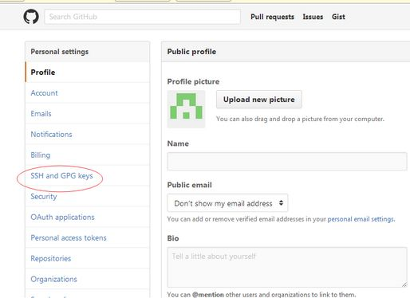
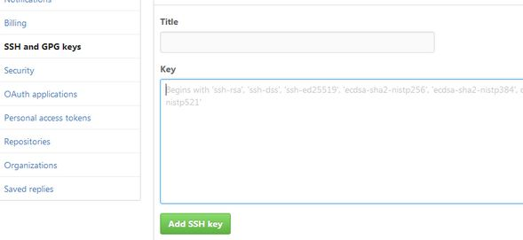

# Git绑定ssh密钥问题

1. 删除 .ssh 文件夹 `C:\Users\(本地用户名)\.ssh` 中的 known_hosts(直接删除即可)

2. 在下载好的Git中的bin目录下（一般是 C:\Program Files\Git\bin）打开bash.exe输入命令ssh-keygen -t rsa -C "username" (注：username为你git上的用户名)，如果执行成功。返回：

   ```shell
   Generating public/private rsa key pair.
   Enter file in which to save the key (/Users/username/.ssh/id_rsa): 
   #这里的username是电脑上的用户名，这个地址也是文件的存储地址，然后按回车如果以前有存储地址会返回
   ```
   - 如果以前有存储地址会返回
     `/Users/your username/.ssh/id_rsa already exists.Overwrite (y/n)?`
     直接输入y回车。
   - 如果以前没有储存地址就会出现
     `Enter passphrase(empty for no passphrase);`
     也直接回车，

   两种情况回车后都会出现

   `Enter same passphrase again` 

   然后接着回车会显示

   ```
   The key's randomart image is:
   +---[RSA 2048]----+
   |    .          . |
   | . = .       .  o|
   |o o * .     . ...|
   |E oo o   .   o.. |
   | B .  o S . ...  |
   |. o    o .o..    |
   | .       o**.    |
   |        .B=+%.   |
   |         +*BoBo  |
   +----[SHA256]-----+
   ```

   这说明SSH key就已经生成了。文件目录就是：username/.ssh/id_rsa.pub.

3.  然后找到系统自动在.ssh文件夹下生成两个文件，id_rsa和id_rsa.pub，用记事本打开id_rsa.pub将全部的内容复制。

4. 打开https://github.com/，登陆账户，进入设置（Settings）找到

5. 然后将你复制的内容粘贴到key中
   
   再点击Add SSH Key  

6. 仍然在bash.exe中输入`ssh -T git@github.com`然后会跳出一堆内容你只需输入yes回车就完事了，然后他会提示你成功了。
   大功告成，再次输入 git clone 就成功了